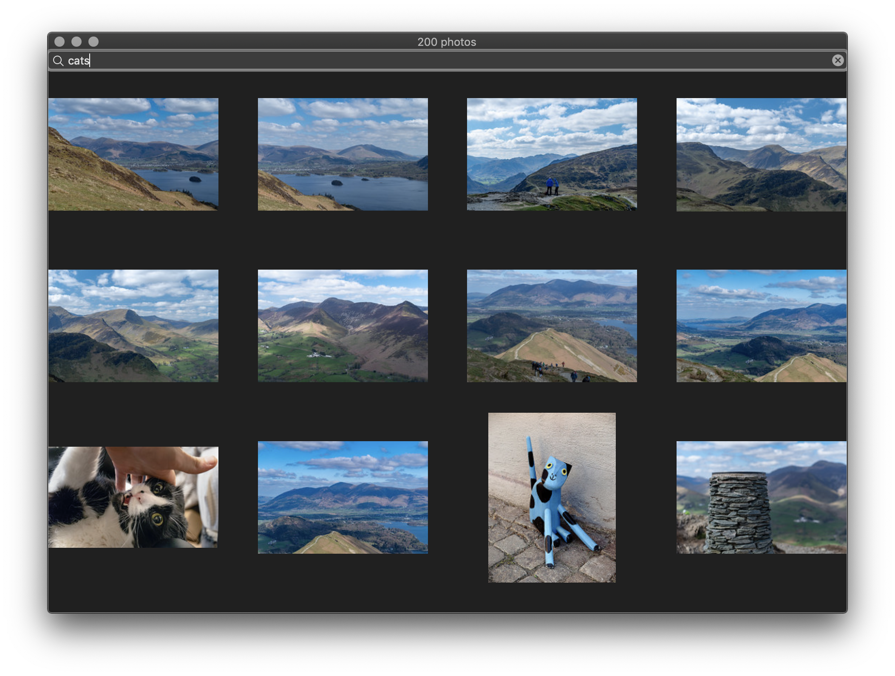

#  UberTest Description

## UI

  

## Architecture

This UberTest application is written in Swift and runs on iOS and macOS. It utilizes Clean Architecture by Uncle Bob which is known in iOS community as VIPER. Nearly 60% of code is reused between iOS and macOS. To to rease code between platforms the app is split into the following targets: 
   - BusinessLogicKit.framework - as the name say it's Business Logic of the application. It contains Viewing protocols, Presenter, Interactor and Repositoring protocols.
   - FlickrKit.framework - it implements Repositoring protocols and incapsulates networking layer.
   - UberTest-iOS.app and UberTest-macOS.app - targets implements Viewing protocols and performs dependency injection.

On the following image you can see all targets and dependencies between them. 

On the image below you can see the architecture of the application. The arrow represents depends-on relationship. As you can see FlickrKit depends on high level Business Logic. The dependency inversion is done with Repositoring Protocol.

## Tests

Since BusinessLogicKit.framework doesn't have any UIKit dependency, tests for this framework are runned on macOS. In future, when project grows in size it give a significant boost in testing time, because there is no need to compile third party components, UI related code and launch simulator in order to run tests on Business Logic.

Things I considered.

- I used NSCache to keep most recently downloaded images in memory. The size of the cache is set to 60 MB. Although it's a little tricky to calculate the size of JPEG image, because system will keep both encoded and decoded JPEG data in memory. For simplicity i used data.length as cost for NSCache.
- The downloading of images is cancelled once the cell goes off screen.
- Search requests are cancelled while user types.
- I used custom CollectionView layout which mimics the layout of Instagram

Things I could improve having more time:

- Have more tests
- Use different priorities for NSURLSessionTask for prefetching and loading for visible cells.
- Throttle user input to reduce amount of search requests.
